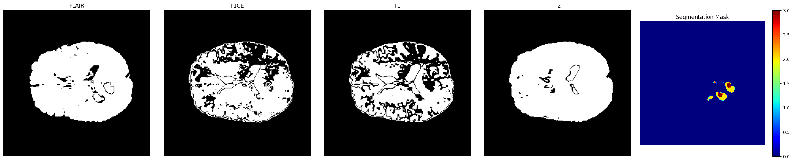

# Multimodal-Deep-Learning-Approach-for-Brain-Tumor-Segmentation

## Overview

This repository contains an advanced system designed for brain tumor segmentation and survival prediction using deep learning techniques. The project utilizes 3D MRI images from the BraTS2020 dataset and implements several cutting-edge algorithms.

## Key Features

- **Segmentation Models**: Implemented UNet, CA-CNN, VNet, Attention UNet, UNETR, and NNFormer for effective processing of 3D MRI images.
- **Survival Prediction**: Utilized deep learning models to predict survival outcomes based on tumor segmentation and other medical features.
- **Dataset**: Based on the BraTS2020 dataset, including preprocessing steps and data augmentation techniques.
- **Evaluation**: Metrics used for evaluating model performance such as Dice coefficient, sensitivity, specificity, and survival prediction accuracy.

## 3D Brain MRI

## Screenshots

